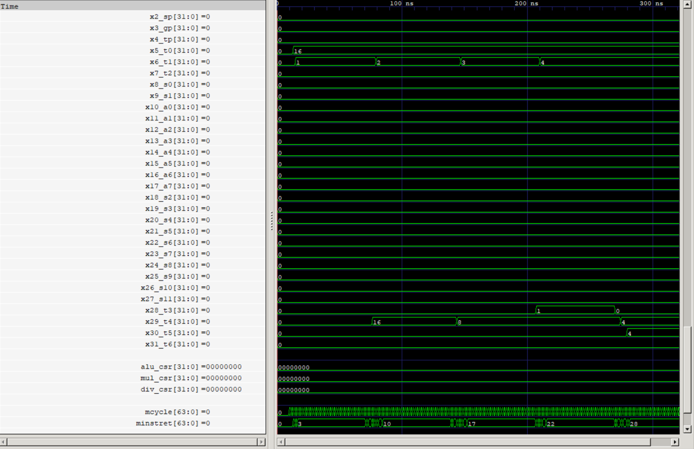

Computer Organization - Spring 2024
==============================================================
## Iran Univeristy of Science and Technology
## Assignment 1: Assembly code execution on phoeniX RISC-V core

- Name:Javad Pourrafi
- Team Members:Ariyan Taghavi
- Student ID: 400411243
- Date:5/24/2024

## Report

### Quick Sort

### Integer Square Root
- `t0` is the input number user which user enter, int this code we set it to 16 to test the code.
- `t1` is the index number which we test to from 1 to input number in the following code.
#### Code Logic
- `main` in this section we assigned input which user can change and also set index to 1.
- `sqrt_loop` in this section we check if the index is lower than input then we proceed the following steps, else we end the code and we don't do anything further.
- `sqrt_check` in the section we check if ouput is multiple of index, if it is then we are one step closer to final result so we gp to `sqrt_check2` , else  index++.
- `sqrt_check2`, in this section we check if `index * index = input`,if it is then we find the answer, else index++;
- `sqrt_done`, we put the answer in `t5` and end the program

#### GTKWave
